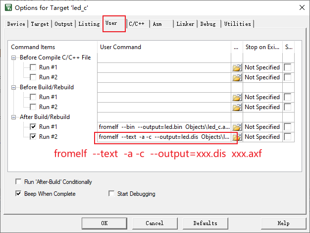

### *2023.9.26*
1. 搭建软件环境
2. 学习.gitignore文件编写规则
3. 学习git基本操作命令，并建立仓库
- `git init`        初始化一个仓库
- `git add`      添加文件到暂存区
- `git commit -m "说明" `    提交
- `git push <远程仓库的分支> <本地当前分支>`
- `git status`   查看工作目录状态
- `git log`      查看提交历史
- `git remote add <远程仓库名称> <远程仓库URL>`
-  `git branch`  查看或创建一个分支
-  `git reset`   清除暂存区的所有文件
---
### *2023.9.27*
1. `xTaskCreate` 创建线程
2.  硬件结构与汇编指令
- ARM寄存器
  - R0~R7： 低寄存器
  - R8~R12：高寄存器
  - R13（SP）：栈指针
  - R14（LR）：保存返回地址
  - R15（PC）：表示当前指令地址，写入新值即可跳转
- 读内存 Load
  ```
  LDR R0, [R1, #4]  ; 将R1+4的地址中的数写入R0
  LDRB  1 byte
  LDRH  2 bytes
  ```
- 写内存
  ```
  STR R0, [R1, #4]  ; 将R0的4个字节写入地址为“R1+4”中
  STRB  1 byte
  STRH  2 bytes
  ```

- 加减
  ```
  ADD
  SUB
  ```
- 跳转
   ```
   B main     ;直接跳转到main
   BL main    ;先保存返回地址到LR寄存器，然后跳转到main
   ```

---
### *2023.10.1*
1. 堆  
   是一片空闲内存，可以去用malloc/free去划分和管理小内存  是一片空闲内存，可以去用malloc/free去划分和管理小内存。    
  `int *ptr = malloc(sizeof(int) * len)`    
  - `malloc`划分出的空间要比len大，因为划分的空间包含了一个头部以及实际存储len字节大小的空间，其中头部保存了实际存储空间的信息，例如空间大小len。`malloc`返回的是头部之后，实际存储内容的地址。  
   - `free`函数去释放内存时，传入实际存储空间的地址，在该函数内部减去头部的大小，得到头部的地址，进而通过读取头部得到实际存储空间的大小，最后释放内存空间
   - 头部 可以理解为链表，存了实际存储空间的大小以及next地址
2. 栈  
  也是一块空闲内存，CPU中的SP寄存器纸箱它吗，可用于函数调用、局部变量、多任务系统里保存现场。  
  - 如何在MDK中生成反汇编？  
    `option` -> `User` -> `After Build/Rebuild` -> 勾选Run#1，并输入`romelf --text -a -c  --output=xxx.dis yyy.axf`，其中xxx是自定义生成的反汇编文件的名称; yyy是编译生成的axf文件存在的路径，在 `Linker`->`Linker control string` 中查看最后-o 所配置的参数，  如下图所示：
      
  - 在C语言的函数入口处，先划分出自己的栈，然后保存LR寄存器里面的值进栈，还会保存局部变量  
    - ***如何保存局部变量？*** `volatile`会让变量保存在栈里，如果不加此关键字，编译器可能会将变量优化，保存在寄存器中；但是如果变量太多，寄存器不够用时，一定会有变量存在栈中。
    - ***在RTOS中，为什么每个任务都要有自己的栈？*** 因为每个任务都有自己的调用关系、自己的局部变量、在进行调度时要**保存现场**（保存现场：将所有的寄存器的值存入该任务对应的栈中）
---
### *2023.10.2*  
#### [4-1] FreeRTOS源码概述FreeRTOS源码概述   
[参考文档](https://rtos.100ask.net/zh/freeRTOS/DShanMCU-F103/chapter7.html)
#### [4-2] 内存管理    
[参考文档](https://rtos.100ask.net/zh/freeRTOS/DShanMCU-F103/chapter8.html)

--- 