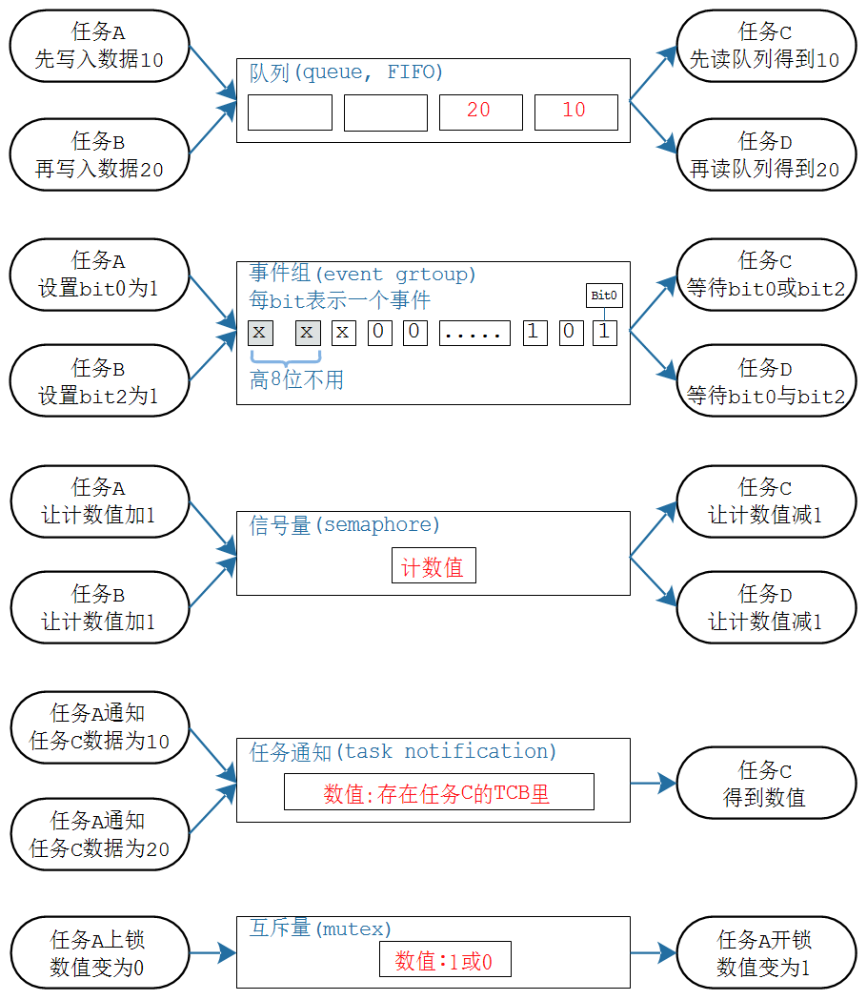

### 同步互斥与通信 
#### [6-1] 同步与互斥通信-有缺陷的同步
相关代码：[12_task_sync_exclusion](../MDK5/12_task_sync_exclusion/Core/Src/freertos.c)
1. 使用全局变量来进行同步会涉及效率问题，
2. **使用同步时，需要考虑如何提高处理器的性能，让等待任务进入阻塞，不占用CPU调度**
``` C
static uint64_t g_time = 0;
static 	uint32_t  g_sum = 0;

void CalculateTask(void){
	uint32_t  i = 0;
	g_time = system_get_ns();
	for(;i < 1000000; i++){
		
		g_sum += i;	
	}
	g_calc_end = 1;
	g_time = system_get_ns() - g_time;
	vTaskDelete(NULL);
}


void LCDShowTask(void){
	uint32_t len = 0;
	while(1){
		LCD_PrintString(0, 0, "Waiting");
		vTaskDelay(3000);
		while(g_calc_end == 0);	 /*占用CPU资源*/
		/*打印信息*/
		if(g_LCDCanUse){
			g_LCDCanUse = 0;
			
			LCD_ClearLine(0, 0);
			len = LCD_PrintString(0, 0, "sum:");
			len += LCD_PrintHex(len,0,g_sum,1);
		
			LCD_ClearLine(0, 2);
			len = LCD_PrintString(0, 2, "time(ms):");
			len += LCD_PrintSignedVal(0,5,g_time/100000);
		}
		vTaskDelete(NULL);
	}
	
}
```


--- 


#### [6-2] 同步与互斥通信-有缺陷的互斥    

``` CC
void LcdPrintTask(void *parms){
	struct TaskPrintInfo *pInfo = (struct TaskPrintInfo *)parms;
	uint32_t  cnt = 0;
	int len; 
	while(1){
		if(g_LCDCanUse){
            /*
            判断并修改变量，在此过程中，很有可能因为任务调度而被打断；
            【解决方法】：先关闭中断，然后判断并修改变量后，开启中断
            */
			g_LCDCanUse = 0;
            /*
                LCD显示是通过I2C协议，该协议是有开始信号、设备地址、数据、结束信号；
                因此，必须要满足互斥，即执行完完整的一条I2C时序协议后，再去进行任务调度
            */
			/*打印信息*/
			len = LCD_PrintString(pInfo->x,pInfo->y,pInfo->name);
			len += LCD_PrintString(len,pInfo->y,":"); /*因为传入的name可能长度不同*/
			LCD_PrintSignedVal(len,pInfo->y,cnt++);
			g_LCDCanUse = 1;
		}
		mdelay(500);
	}
}

```
关中断去保护临界资源是有缺陷的，例如：任务A和B同时去访问一个资源，  
&nbsp;&nbsp;&nbsp;&nbsp;&nbsp;&nbsp;&nbsp;&nbsp;*A抢到了在执行->B在判断->A抢到了在执行->B在判断*  
这种情况下，B还是在占用CPU资源；  
如果B判断后发现无法执行而被阻塞，  
&nbsp;&nbsp;&nbsp;&nbsp;&nbsp;&nbsp;&nbsp;&nbsp;*A抢到了在执行->B在判断，被阻塞->A抢到了在执行->A执行->A执行完唤醒B->B抢到了执行*  
在这种情况下，CPU效率更高


--- 

#### [6-3] 同步与互斥通信-FreeRTOS提供的方法 
在多个函数之间，使用全局变量也算通信，但是如何通信不重要，重要的是**怎么保证通信的结果是正确的**  
- 互斥的方法保证正确性
- 阻塞和唤醒的同步机制来提高效率  



---