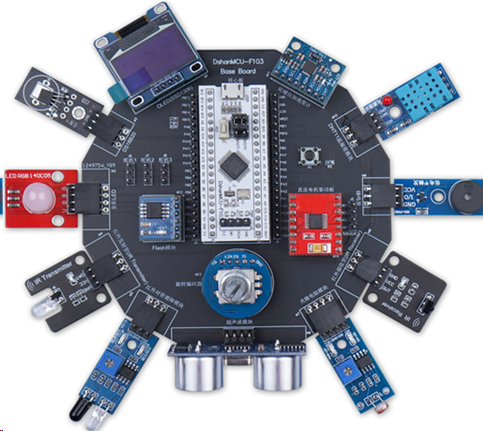

## 本仓库用来记录FreeRTOS学习过程并存储相关代码
---
相关硬件：    

---
###  [Chapter 1~4](./doc/Chapter1-4.md)
###  [任务管理](./doc/Chapter5.md)  
###  [同步互斥与通信](./doc/Chapter6.md)
###  [队列与队列集](./doc/Chapter8.md)
###  [信号量与互斥量](./doc/Chapter9.md)
###  [事件组](./doc/Chapter10.md)
###  [任务通知](./doc/Chapter11.md)
---
